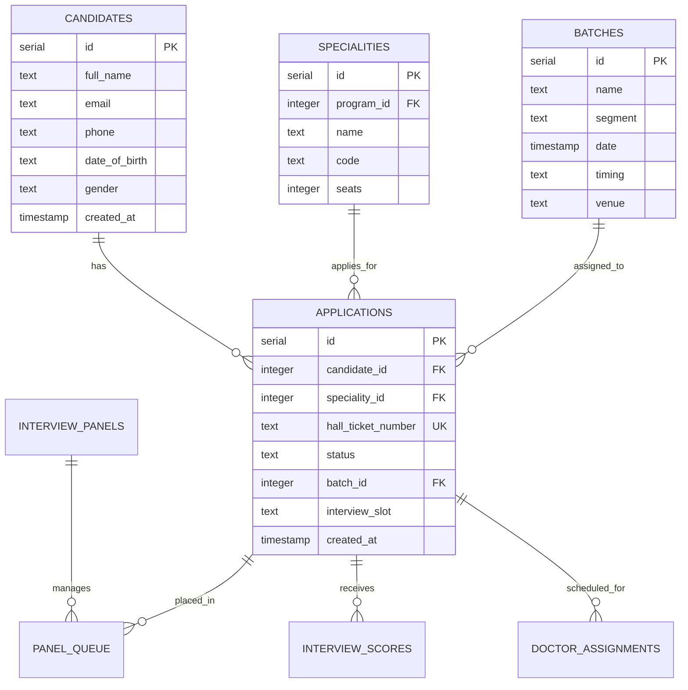

# Implementation Plan – Ophthalmology Fellowship System Upgrade

We are upgrading the Ophthalmology Examination and Fellowship Application Management System. This plan implements a fully relational, multi-specialization workflow where each specialization application for a candidate is treated as an independent path with its own Hall Ticket ID, queue status, batch, and interview flow. It also completely overhauls the Admin Dashboard, Candidate Queue UI, Live TV Display, and PDF/Excel generation with hospital-grade aesthetics.

---

## Segment & Specialization Grouping

The system categorizes all applications into exactly **two segments**:

1. **Retina Segment**:
   - Vitreoretinal Surgery (Vitreo Retina – Surgical)
   - Medical Retina (Medical Retina – Non-Surgical)
2. **Anterior Segment** (All other specialities):
   - Cornea & External Disease
   - Cataract & Refractive Surgery
   - Glaucoma
   - Pediatric Ophthalmology
   - Orbit & Oculoplastics

---

## Hall Ticket Generation & Download Actions

- **Approved-Only Hall Tickets**: A Hall Ticket / Candidate ID is only generated, assigned, and made available for download **after the candidate's submission is approved** (i.e. status is `approved`, `verified`, `scheduled`, `interviewed`, or `completed`).
- **Aesthetic PDF Hall Ticket Layout**:
  - **Branded Header**: "Sankara Academy of Vision", Logo, and Title: "ADMIT CARD / HALL TICKET".
  - **Embedded Passport Photo**: The passport photo will be fetched, scaled, and centered natively within a styled borders frame.
  - **Identity Fields**: Candidate Name, Hall Ticket ID, Candidate Code / Application ID, Date, Reporting Time, and Venue.
  - **Critical Notice**: **"IMPORTANT: Candidates must bring an ORIGINAL Government-issued Photo ID card (Aadhaar, Passport, Driving License, or Voter ID). Photocopies / Xerox copies will NOT be accepted under any circumstances."**
  - **Unified Signature Matrix**:
    - *MCQ Exam Signature*: `[ Signature Box ]`
    - *Psychometry Exam Signature*: `[ Signature Box ]`
    - *Panel Interview Signatures*: For each specialization, the card will display exactly **4 separate doctor signature boxes** (e.g. Doc 1, Doc 2, Doc 3, Doc 4) to support multiple panel evaluators signing off independently for that specialization.
- **PDF Download Icon**: A highlighted PDF download icon button will be displayed next to each approved candidate row in the Candidate List table for quick download.

---

## Strict Specialization-Based Scoring & Access

To maintain independent evaluations for candidates applying to multiple specialities, we implement **strict scoring and access separation**:
- **Specialization Isolation**: Every interview panel is bound to a single `specialityId`.
- **Restricted Access**: Panel doctors logged into their specific panel station can **only view and score the specialization interview assigned to their panel**.
- **No Overlapping Entry**: When John Doe is queued in the *Medical Retina* panel, the MR doctors can only view and input scores for his *Medical Retina* application. When John Doe is sent to the *Oculoplasty* panel, that panel can only enter marks for *Oculoplasty*.
- **Relational Scoring**: Scores are saved independently in `interviewScoresTable` along with the matching `specialityId` and `doctorId`, preventing any cross-specialization data leakage or overwrites.

---

## LOR Image-to-PDF Conversion

- **Dynamic LOR PDF Serving**: If a candidate uploads an image (PNG, JPG, or JPEG) for LOR 1 or LOR 2, the backend will dynamically convert it into a standard A4 PDF on the fly using `pdfkit` before serving it. This ensures all LOR documents view correctly and professionally in the browser.

---

## Fixes to Application Printing (PENDING ID Bug)

- **Approved ID Fix**: Currently, in the Submissions tab's A4 HTML Print View, the candidate registration code is displaying `"PENDING"` even after approval because it references `viewedSub.candidateCode` (which is undefined in `application_submissions`). We will update the component to join the candidate record based on `viewedSub.candidateId` or email and display the actual generated Candidate Code (e.g. `SAV-2026-XXXX`) upon approval.
- **Passport Photo Cropping**: We will enhance the HTML5 Canvas-based cropping and formatting in `ApplicationFormsPage.tsx` to compile any PNG/JPEG photo upload into a crisp white-backed JPG data URL, rendering it perfectly in the printable form view.

---

## Dashboard Analytics & Rich Excel Export

- **Advanced Command Dashboard**: Redesigned Command Dashboard with HSL-tailored dark modes, glassmorphism headers, and interactive grids showing Retina Segment vs. Anterior Segment metrics and real-time live data with 2-minute auto-refresh.
- **Complete Stats Excel Sheet**: The `/reports/cycle-report` endpoint will be enhanced to export a fully comprehensive workbook with a **"Cycle Summary Overview"** tab (total applications, approved candidates, active staff counts, conversion rates) and subspecialty specific worksheets, designed with colored headers, proper column auto-fitting, and data grids that allow instant chart generation in Excel/Google Sheets.

---

## Relational Architecture & Database Normalization

We will introduce a relational mapping layer where **one candidate (Applicant) can have multiple applications (each representing a chosen Specialization)**.

---

## Proposed Changes

### 1. Database Layer (`lib/db/src/schema/`)

#### [NEW] [applications.ts](file:///c:/Users/HP/Documents/Sankara/New_Project/2%20EXAM%20OPS%20SYSTEM%20FOR%20DOCTORS/Projects/Version%20Zips/v1.0.2/savprojectv2-version2/lib/db/src/schema/applications.ts)
- Create `applicationsTable` containing candidate, speciality, hall ticket number (generated only on approval), status, batch, and slot references.

#### [MODIFY] [panels.ts](file:///c:/Users/HP/Documents/Sankara/New_Project/2%20EXAM%20OPS%20SYSTEM%20FOR%20DOCTORS/Projects/Version%20Zips/v1.0.2/savprojectv2-version2/lib/db/src/schema/panels.ts)
- Add `specialityId` to `interviewPanelsTable`.

#### [MODIFY] [exams.ts](file:///c:/Users/HP/Documents/Sankara/New_Project/2%20EXAM%20OPS%20SYSTEM%20FOR%20DOCTORS/Projects/Version%20Zips/v1.0.2/savprojectv2-version2/lib/db/src/schema/exams.ts)
- Add `specialityId` referencing `specialitiesTable.id` to `batchCandidatesTable`.

#### [MODIFY] [interviews.ts](file:///c:/Users/HP/Documents/Sankara/New_Project/2%20EXAM%20OPS%20SYSTEM%20FOR%20DOCTORS/Projects/Version%20Zips/v1.0.2/savprojectv2-version2/lib/db/src/schema/interviews.ts)
- Add `specialityId` referencing `specialitiesTable.id` to `interviewScoresTable` and `doctorAssignmentsTable`.

#### [MODIFY] [index.ts](file:///c:/Users/HP/Documents/Sankara/New_Project/2%20EXAM%20OPS%20SYSTEM%20FOR%20DOCTORS/Projects/Version%20Zips/v1.0.2/savprojectv2-version2/lib/db/src/schema/index.ts)
- Export `applicationsTable`.

---

### 2. Backend API Routes (`artifacts/api-server/src/`)

#### [MODIFY] [storage.ts](file:///c:/Users/HP/Documents/Sankara/New_Project/2%20EXAM%20OPS%20SYSTEM%20FOR%20DOCTORS/Projects/Version%20Zips/v1.0.2/savprojectv2-version2/artifacts/api-server/src/storage.ts)
- Add dynamic LOR Image-to-PDF conversion inside the private object serving endpoint `/storage/objects/*path`.

#### [MODIFY] [dashboard.ts](file:///c:/Users/HP/Documents/Sankara/New_Project/2%20EXAM%20OPS%20SYSTEM%20FOR%20DOCTORS/Projects/Version%20Zips/v1.0.2/savprojectv2-version2/artifacts/api-server/src/routes/dashboard.ts)
- Update `/dashboard/summary` for detailed Retina vs. Anterior metrics, historical statistics, and Today's metrics.

#### [MODIFY] [reports.ts](file:///c:/Users/HP/Documents/Sankara/New_Project/2%20EXAM%20OPS%20SYSTEM%20FOR%20DOCTORS/Projects/Version%20Zips/v1.0.2/savprojectv2-version2/artifacts/api-server/src/routes/reports.ts)
- Enhance `/reports/cycle-report` to generate styled summary Excel tab.
- Add Hall Ticket PDF generation route `/applications/:id/hall-ticket` containing photo, instructions, government ID warning, and signature block with exactly 4 boxes per specialization.

#### [MODIFY] [interviews.ts](file:///c:/Users/HP/Documents/Sankara/New_Project/2%20EXAM%20OPS%20SYSTEM%20FOR%20DOCTORS/Projects/Version%20Zips/v1.0.2/savprojectv2-version2/artifacts/api-server/src/routes/interviews.ts)
- Strict access check: Restrict interview score entry `/interviews/scores` to the speciality matching the doctor's active panel. Filter and return scores independently per speciality.

#### [MODIFY] [candidates.ts](file:///c:/Users/HP/Documents/Sankara/New_Project/2%20EXAM%20OPS%20SYSTEM%20FOR%20DOCTORS/Projects/Version%20Zips/v1.0.2/savprojectv2-version2/artifacts/api-server/src/routes/candidates.ts)
- Split candidate specializations into separate applications upon approval.
- Add name, date applied sorting and filters.

---

### 3. Frontend Pages & Components (`artifacts/fellowship-exam/src/`)

#### [MODIFY] [DashboardPage.tsx](file:///c:/Users/HP/Documents/Sankara/New_Project/2%20EXAM%20OPS%20SYSTEM%20FOR%20DOCTORS/Projects/Version%20Zips/v1.0.2/savprojectv2-version2/artifacts/fellowship-exam/src/pages/DashboardPage.tsx)
- Redesign with dark blocks and subspecialty color schemes.
- Add "Today's Live Statistics" with 2-minute auto-refresh.

#### [MODIFY] [ApplicationFormsPage.tsx](file:///c:/Users/HP/Documents/Sankara/New_Project/2%20EXAM%20OPS%20SYSTEM%20FOR%20DOCTORS/Projects/Version%20Zips/v1.0.2/savprojectv2-version2/artifacts/fellowship-exam/src/pages/ApplicationFormsPage.tsx) & [CandidatesPage.tsx](file:///c:/Users/HP/Documents/Sankara/New_Project/2%20EXAM%20OPS%20SYSTEM%20FOR%20DOCTORS/Projects/Version%20Zips/v1.0.2/savprojectv2-version2/artifacts/fellowship-exam/src/pages/CandidatesPage.tsx)
- Remove old "Ready Filter" completely.
- Fix PENDING registration ID print bug.
- Implement sorting filters (Name A-Z/Z-A, Date Applied Newest/Oldest).
- Add Hall Ticket PDF download icon next to approved candidate rows.

#### [MODIFY] [InterviewsPage.tsx](file:///c:/Users/HP/Documents/Sankara/New_Project/2%20EXAM%20OPS%20SYSTEM%20FOR%20DOCTORS/Projects/Version%20Zips/v1.0.2/savprojectv2-version2/artifacts/fellowship-exam/src/pages/InterviewsPage.tsx)
- Modify Doctor Interface to bind scoring directly to the panel's active specialization. Restrict score entries to *only* show and submit ratings for that specialization, ignoring all other specialities of the candidate.

#### [MODIFY] [QueueDisplayPage.tsx](file:///c:/Users/HP/Documents/Sankara/New_Project/2%20EXAM%20OPS%20SYSTEM%20FOR%20DOCTORS/Projects/Version%20Zips/v1.0.2/savprojectv2-version2/artifacts/fellowship-exam/src/pages/QueueDisplayPage.tsx)
- Upgrade waiting hall live TV to show split station queues.

---

## Verification Plan

### Automated Tests
- Run database migrations:
  `pnpm --filter @workspace/db run push`
- Build the frontend and backend to verify zero compile-time issues.

### Manual Verification
1. **Approval & Code Generation**: Approve a candidate, confirm the generated hall ticket code, and verify that the HTML Print View displays this candidate code instead of `"PENDING"`.
2. **Strict Marks Allocation Check**: Log in as a Medical Retina panel doctor. Verify that the interview page only permits entering scores for Medical Retina, and hides Oculoplasty or any other specialization. Log in as an Oculoplasty doctor and verify the inverse.
3. **Hall Ticket Layout**: Download the hall ticket PDF, confirming that the photo is embedded, the "Original ID Required" warning is displayed, and the signature block lists 4 signature boxes per specialization.
4. **Excel Stats Export**: Download the Excel report, verifying it includes a dedicated summary tab and clean data grids.
